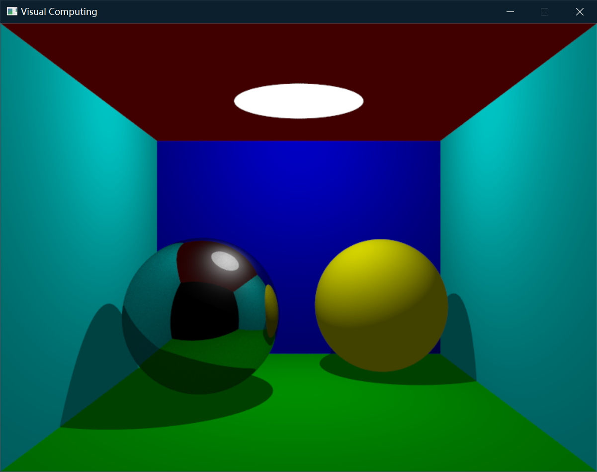
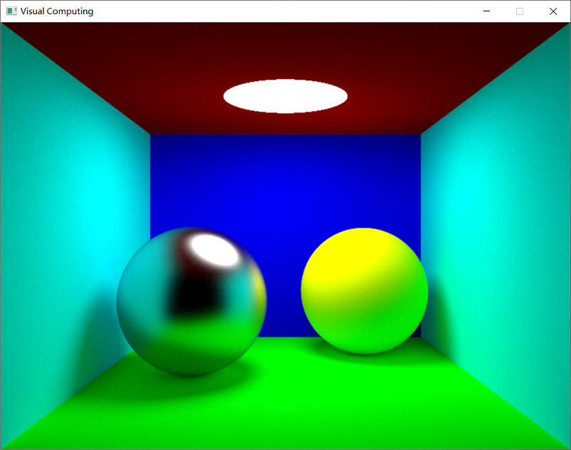

# 可视计算概论 Lab2: 全局光照明

## 安装

本项目目前支持 Windows 和 MacOS，不支持 Linux。

### 1.安装依赖

本项目需要以下工具构建：

* [git](http://git-scm.com/)：版本管理工具
* C++编译器：Windows 下推荐使用 Visual Studio（MSVC），MacOS 使用 XCode（Apple Clang）
* [xmake](https://xmake.io/#/)：项目构建工具，参考[官方文档](https://xmake.io/#/guide/installation)安装

### 2.编译

编译命令：
```
xmake f -m release
xmake
```
* 重复编译出错时可以使用 `xmake clean` 清空缓存
* `xmake f -m debug` 可以切换到 debug 模式，切换之后需要运行 `xmake -r` 重新编译
* xmake 会自动下载所需要的第三方库文件并链接到项目中，如果下载过程中遇到网络问题，有如下解决方式：
  - 可运行 `xmake g --proxy_pac=github_mirror.lua` 将 github.com 重定向到 hub.fastgit.xyz
  - 可运行 `xmake g --pkg_searchdirs=<download-dir>` 并根据报错提示手动下载
  - 打开本地代理，使用命令行设置好环境变量 `HTTPS_PROXY="127.0.0.1:<port>"`，之后在命令行中运行 `xmake`

### 3.运行

运行命令：
```
xmake run
```
编译生成的二进制程序在 `bin` 目录下，也可以进入 `bin` 目录下手动执行

### 使用 IDE

我们推荐大家使用 `VSCode`、`Vim`、`Emacs` 等代码编辑工具编辑代码，使用 `xmake project -k compile_commands` 为代码编辑器添加 Intellisense 支持，然后在命令行中使用 `xmake` 构建系统。如果想要使用 IDE 编译和测试代码，除了上面介绍的流程外也可以使用 xmake 构建 IDE 项目：
* 对于 Windows 系统，运行 `xmake project -k vsxmake` 会在 vsxmake20xx 目录下生成 Visual Studio 的项目
* 对于 Mac 系统，运行 `xmake project -k xcode` 可以生成 Xcode 项目
* 对于 Clion 等其他IDE，运行 `xmake project -k cmake` 生成 cmake 项目并使用 IDE 中的 cmake 功能


### 使用 MinGW 编译器

Windows 上可以选用 MinGW 编译器替代 Visual Studio。安装 MinGW-w64/MSYS2 后，需要将 g++.exe 所在路径添加到环境变量 PATH 中。

编译命令与 Visual Studio 相比需要一点小改动：
```
xmake f -p mingw -m release
xmake
```
如果提示找不到 mingw，则需要手动输入 mingw 目录（以 `C:\MinGW` 为例）：
```
xmake f -p mingw -m release --mingw=C:\MinGW
xmake
```
运行同上。

## 作业介绍

本次作业要求实现 3D 全局光照明渲染的相关算法，主要分为三个部分，满分 12 分。

### Part 0. 阅读代码 (0')

在动手开始之前请先阅读各个部分的代码，了解代码的调用逻辑。

### Part 1. Whitted-Style Ray Tracing (6')

Step 0. 对照代码总结 Whitted-Style Ray Tracing 的算法流程。(2')

Step 1. 实现光线求交算法。场景的求交函数入口在 `Scene::Intersect()` 函数，这个函数会调用在 `object.h` 中实现的各个 `Object` 类型的求交函数。目前场景中只有 `Plane` 和 `Sphere` 两种隐式几何类型，所以需要实现的部分只有 `Plane::Intersect()` 和 `Sphere::Intersect()` 函数。(2')

Step 2. 补全 `globillum.cpp` 中的 `RayTrace()` 函数。需要实现的部分为 Phong Shading 计算颜色，以及递归生成光线。(2')

最后渲染出的图像如下图所示：



> 提示：在 `renderer.cpp` 的 `MainLoop()` 函数中提供了串行和并行两种调用方式，debug 时可以降低窗口分辨率运行串行代码。

### Part 2. Path Tracing (6')

Step 0. 参照课件和其它资料，学习 Path Tracing 和 Monte-Carlo 积分，总结 Path Tracing 与 Whitted-style Ray Tracing 的异同。(2')

Step 1. 阅读 `globillum.cpp` 中的 `Sample()` 和 `AxisAngle()` 函数，总结其含义。(2')

Step 2. 补全 `globillum.cpp` 中的 `PathTrace()` 函数。需要实现的部分为 Monte-Carlo 积分，应借助 Step 1 中提到的 `Sample()` 函数。这里不要求实现 Russian Roulette。(2')

最后得到的图像如下图所示（收敛需要10分钟以上，完全降噪需要更久，请耐心等待）：



> 提示：在 `renderer.cpp` 的 `MainLoop()` 函数中提供了 Part 1/2 两种算法的切换开关。

## 作业要求

请独立完成作业，并将整理出的算法、核心代码和实验结果整理到一个 PDF 文档中，提交到教学网上。

